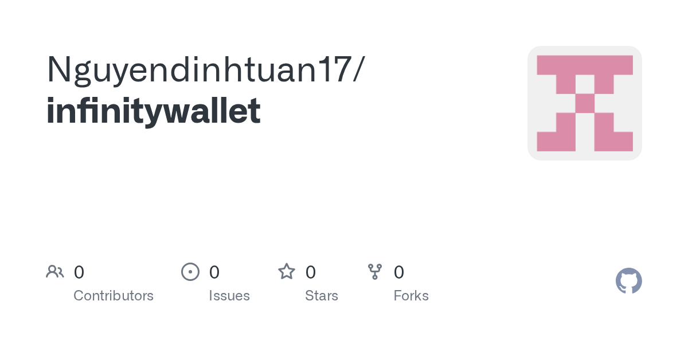

# gcloud & hello-world-1 Package Components

Welcome to the **gcloud** and **hello-world-1** multi-component repository.



Image source: [Nguyendinhtuan17/infinitywallet](https://github.com/Nguyendinhtuan17/infinitywallet).

## Components Included:
- **Ruby Gem Package (`gcloud_gem`)**: Located under `gcloud_gem.gemspec` & `lib/`
- **Node.js Express Server**: `server.js` with server ready startup logs
- **Cloud Run Hello World Service**: Flask application (`app.py`), `Dockerfile`, and `Procfile`

## Getting Started

### 1. Ruby Gem Package
```bash
gem build gcloud_gem.gemspec
```

### 2. Node.js Express Server
```bash
node server.js
```

### 3. Python / Flask App
```bash
pip install -r requirements.txt
python app.py
```
https://github.com/Cleanskiier27/gcloud/packages